# QA Test Generator — AI Codebase Copilot

This document describes the application implemented in `backend/app/` and `frontend/src/`, together with its dependency manifests, Docker configuration, and startup scripts. Source code is the authority; comments and older design documents may describe behavior that has since changed. Model names and configuration values below are repository defaults, not claims about the latest provider offerings.

## Contents

1. [Title, overview, and purpose](#1-title-overview-and-purpose)
2. [Use case and functional requirements](#2-use-case-and-functional-requirements)
3. [Technologies and technical decisions](#3-technologies-and-technical-decisions)
4. [Application architecture and data flow](#4-application-architecture-and-data-flow)
5. [Backend API and services](#5-backend-api-and-services)
6. [User interface and user interaction](#6-user-interface-and-user-interaction)
7. [GenAI implementation](#7-genai-implementation)
8. [Installation and configuration](#8-installation-and-configuration)
9. [Running the application](#9-running-the-application)
10. [Usage examples](#10-usage-examples)
11. [Further improvements](#11-further-improvements)

## 1. Title, overview, and purpose

**QA Test Generator** is a repository assistant presented in the UI as **AI Codebase Copilot**. Developers connect a GitHub repository, ask questions grounded in its indexed files, and request new or improved Python tests. Generated tests are shown as a Git diff, assessed by an AI reviewer, and submitted to the repository owner for approval, rejection, or revision. Approval commits the patch, pushes a separate branch, and opens a GitHub pull request.

The application addresses two related problems: understanding an unfamiliar codebase and writing tests that fit its actual implementation and conventions. It combines repository retrieval, conversational interaction, structured generation, static review, and a human decision before remote publication.

The current scope is explicit:

- Only repositories hosted at `github.com` are accepted. Registration requires a GitHub token, including for public repositories.
- Indexing loads eligible committed text files, but the repository must contain at least one usable Python file.
- Generation is limited to Python test files. It does not implement application features or edit production code.
- Generated tests are **not executed**. A passing AI review is a static assessment, not proof that the tests pass or measure sufficient coverage.
- Publication creates a pull request; the application does not merge it.

Primary sources: [repository service](backend/app/services/repository_service.py), [Git URL validation](backend/app/integrations/git/repository_url.py), [agent graph](backend/app/agents/graph.py), [test-file validation](backend/app/services/coding_runs/test_file_validation.py), and [Copilot UI](frontend/src/routes/_layout/index.tsx).

## 2. Use case and functional requirements

### 2.1 Main use case

A developer wants to understand a Python repository and add tests for a specific behavior without manually assembling all relevant source files, existing tests, and framework references. They connect the repository once, open a conversation, explore its implementation, and request a reviewed test patch.

### 2.2 Expected user workflow

1. Sign up or log in with an existing account.
2. Choose **Add your code repository** or the sidebar's repository-add control.
3. Supply the GitHub URL, access token, and optional token expiration in days.
4. Wait for registration to progress through `pending`, `cloning`, and `indexing` to `ready`. A failed operation exposes a failure reason.
5. Select the repository and create a **New session**.
6. Ask a repository question or explicitly request test code. The backend selects the workflow from the message.
7. Read a streamed, cited answer, or inspect the generated patch and review findings.
8. For a reviewed patch, choose **Approve**, **Reject**, or **Edit** with feedback.
9. On approval, follow **View Pull Request** to GitHub and run the repository's own validation before merging there.
10. Reopen the session to read persisted conversation history, run outcomes, patches, and recorded AI cost estimates.

### 2.3 Implemented functional requirements

| Area | Implemented behavior |
|---|---|
| Accounts | Public signup; email/password login; bearer-token authentication; profile and password changes; password recovery/reset; account deletion with a superuser self-deletion restriction. |
| Administration | API endpoints to list, create, update, and delete users; superuser-only global cost total. There is no user-management page in the current frontend route tree. |
| Repository onboarding | Canonicalize supported Git URLs, prevent duplicates per user, encrypt credentials, clone the default branch, record the indexed commit, and index files in a background task. |
| Repository management | List/read repository metadata, replace credentials, and delete repository checkout, vector index, and relational records. Deletion is exposed through the API, not a current UI control. |
| Repository isolation | Associate repositories with users, use a Weaviate tenant per user, filter retrieval by repository ID, and bind each session immutably to one repository. |
| Conversations | Create/list sessions, derive the initial title from the first message, stream turns, persist exchanges and citations, and page through older history. |
| Question answering | Classify question shape, retrieve repository context, generate a grounded answer, and expose source paths. |
| Test generation | Validate task scope, retrieve source/test context, propose complete files, validate write paths, build a canonical Git diff, and perform static review. |
| Revision and approval | Retry low-scoring or empty proposals within a configured budget; pause non-empty final proposals for owner approval, rejection, or feedback-driven editing. |
| Publication | Commit an approved patch on a unique non-default branch, push with the stored token, and open a GitHub pull request containing review information. |
| Recovery and visibility | Persist coding-run status, patch, findings, failure stage, and pull-request URL; display recorded outcomes after reload. |
| AI cost | Capture supported chat-model usage for fresh turns and expose estimated totals per turn, run, session, repository, user, and all users. See the limitations in section 7.6. |

### 2.4 Current boundaries

There is no exposed repository refresh/reindex endpoint, branch selector, file-upload workflow, test runner, coverage engine, general-purpose code-editing mode, or session rename/delete endpoint. Updating a token validates remote access and replaces the credential; it does not restart failed indexing. The optional expiration value is stored as metadata and is not an automatic token-renewal mechanism.

New test files must be placed under an **already existing** directory named `test` or `tests`, including nested directories. Existing Python test files can also be recognized by a `test_` filename prefix or `_test.py` suffix. A repository without an existing test root may therefore be unsuitable for adding new files through this workflow.

## 3. Technologies and technical decisions

The reasons below explain the role each choice serves in the implementation. They are architectural interpretations of the source, rather than claims about an undocumented technology-selection process. Dependency ranges live in [backend/pyproject.toml](backend/pyproject.toml) and [frontend/package.json](frontend/package.json); resolved dependencies are recorded in [uv.lock](uv.lock) and [bun.lock](bun.lock).

| Layer | Technologies | Role and practical reason |
|---|---|---|
| Backend runtime | Python; Python 3.13 in the backend Docker image | Hosts the API, Git workflows, retrieval, and AI orchestration in one application. |
| HTTP API | FastAPI, Starlette, Pydantic v2, `pydantic-settings` | Validated request/response contracts, dependency injection, OpenAPI generation, configuration validation, and streaming HTTP responses. |
| Relational persistence | PostgreSQL 18, SQLModel/SQLAlchemy, Psycopg 3, Alembic | Durable ownership, session history, repository documents, coding runs, and usage records, with database constraints and migrations. |
| Workflow orchestration | LangGraph, PostgreSQL checkpoint saver | Explicit conditional workflows and durable interruption/resumption for human decisions. |
| Model/tool integration | LangChain; OpenAI and Anthropic adapters | Structured output, streamed answers, bounded tool-using agents, model callbacks, and provider fallback. |
| Retrieval | Weaviate 1.37.4, LangChain Weaviate integration | Hybrid keyword/vector retrieval with tenant and repository filtering. |
| Embeddings | Voyage AI, Hugging Face Transformers tokenizer | Code-oriented embeddings and tokenizer-sized chunks. |
| Reranking | Cohere Rerank | Reorders retrieved chunks before full parent files enter the prompt. |
| External research | Tavily | Looks up test-framework syntax and conventions for generator/reviewer agents. |
| Git/GitHub | Git CLI, GitPython/GitLoader, `giturlparse`, PyGithub | Clone and inspect repositories, load tracked text, derive real diffs, publish branches, and create pull requests. |
| Authentication | PyJWT, pwdlib with Argon2/Bcrypt, Fernet cryptography | Signed access/reset tokens, password hashing and hash upgrades, encrypted repository credentials. |
| Email | `emails`, Jinja2, HTML templates with MJML sources | Password recovery and account/test emails; local Mailcatcher supports inspection. |
| Frontend | React 19, TypeScript, Vite 7 with SWC | Typed SPA with fast development builds and reusable interactive components. |
| Navigation and server state | TanStack Router, React Query | File-based routes, URL-driven selection, cached API data, polling, and query invalidation. |
| UI and forms | Tailwind CSS 4, Radix primitives, React Hook Form, Zod, Lucide, Sonner, `next-themes` | Accessible controls, validated account forms, consistent styling, notifications, and theme switching. |
| Rich output | `react-markdown`, `remark-gfm`, custom `DiffView` | Render answer formatting, tables/code blocks, and file-by-file unified diffs. |
| API client | `@hey-api/openapi-ts`, generated Axios client; native `fetch` for SSE | Generate typed REST calls from FastAPI; handle POST streaming separately. |
| Packaging and deployment | uv workspace, Bun workspace, Docker Compose, Nginx, Traefik | Reproducible dependencies, local multi-service operation, static frontend serving, and host-based deployment routing. |
| Quality and observability | pytest, coverage, Playwright, Ruff, mypy/ty, Biome, prek, GitHub Actions, optional Sentry/LangSmith | Automated checks, browser tests, formatting/type checks, error reporting, and AI traces. |

Three structural decisions are central:

1. **Search chunks, supply complete files.** Weaviate stores small chunks for search; PostgreSQL stores full parent documents for grounded generation.
2. **Separate model proposals from file operations.** Agents return structured data. Backend services validate paths, write files, derive diffs, and publish Git changes.
3. **Separate transient streams from durable records.** SSE supplies progress and immediate results. Database APIs restore history and run details after the connection closes.

## 4. Application architecture and data flow

### 4.1 System architecture

The application is a React SPA backed by a modular FastAPI service. It uses PostgreSQL, Weaviate, and backend-local Git checkouts. AI and GitHub integrations are external services; there is no separate worker queue service in the supplied Compose stack.

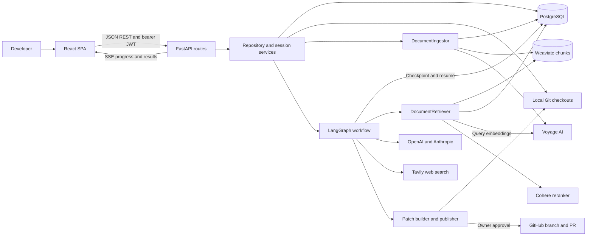

### 4.2 Source layout and responsibilities

| Path | Responsibility |
|---|---|
| `backend/app/main.py` | FastAPI creation, CORS, monitoring, startup/shutdown resources, router and exception registration. |
| `backend/app/api/` | HTTP routes and the dependency-injection composition root. |
| `backend/app/core/` | Settings, authentication/credential primitives, domain errors, checkpoint lifecycle. |
| `backend/app/db/models/` | SQLModel entities and constraints. |
| `backend/app/db/persistence/` | Database queries, lifecycle updates, history ordering, and usage storage. |
| `backend/app/services/` | Repository/session rules, background-work composition, cost rollups, and coding-run operations. |
| `backend/app/agents/` | Unified graph, intent/question routing, generator/reviewer, prompts, tool limits, and fallbacks. |
| `backend/app/rag/` | File ingestion/chunking and hybrid retrieval/reranking/parent hydration. |
| `backend/app/integrations/` | Provider clients, Weaviate resources, Git commands, web search, and email. |
| `backend/app/schemas/` | API payloads, structured AI outputs, and typed stream events. |
| `backend/app/streaming/` | Conversion of LangGraph events to application events and SSE frames. |
| `backend/app/alembic/` | Application database migrations. |
| `frontend/src/routes/` | Authentication, settings, onboarding, and Copilot pages. |
| `frontend/src/components/` | Sidebar, profile controls, shared UI primitives, and diff display. |
| `frontend/src/client/` | Generated REST client and API types. |
| `frontend/src/lib/agentStream.ts` | Authenticated POST stream reader. |
| `frontend/tests/`, `backend/tests/` | Browser and backend tests. |

### 4.3 Persistent data model

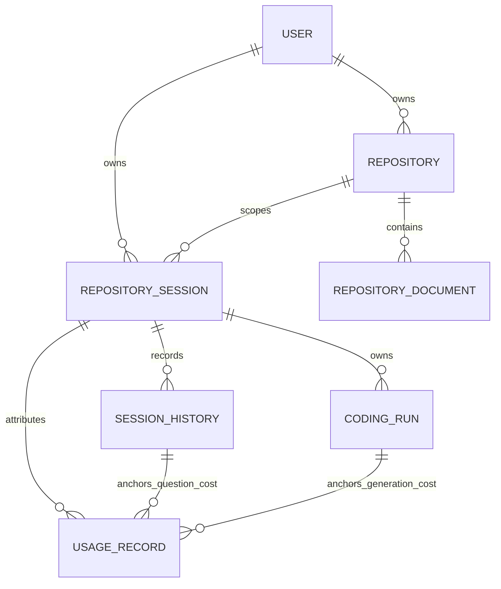

| Entity | Important persisted information |
|---|---|
| `User` | UUID, unique email, password hash, name, active/superuser flags, creation time. |
| `Repository` | Owner user, canonical URL, GitHub identity, encrypted token, optional token expiry, checkout path, default branch, indexed SHA, lifecycle status, failure reason. Unique per user and URL. |
| `RepositoryDocument` | Complete file content and metadata: source path, type/category/language, branch, and commit SHA. |
| `RepositorySession` | Owner, immutable repository binding, derived title, creation/activity timestamps. |
| `SessionHistory` | Ordered user/assistant messages, citations, optional coding-run ID, timestamps. Positions are unique within the session. |
| `CodingRun` | Session, unique checkpoint thread ID, lifecycle/failure information, generated branch, canonical diff, complete file proposals, external references, review findings, and PR URL. |
| `UsageRecord` | Actual responding model/provider, graph node, token counts, estimated cost, user/repository/session attribution, and optional turn or run anchor. |

LangGraph checkpoint tables are separate from these domain tables. They retain graph state needed to resume a paused workflow. `PostgresSaver.setup()` provisions them at application startup; Alembic manages the application's domain schema.

Repository documents use deterministic UUIDs derived from repository, commit, and source path. Vector chunks carry `parent_id`, repository ID, source metadata, and commit identity. The full document remains the prompt source after hydration.

### 4.4 Repository registration and indexing

1. `POST /repositories/` validates/canonicalizes the URL and checks for a duplicate belonging to the same user.
2. The service encrypts the supplied token, persists a `pending` repository, schedules a FastAPI background task, and returns HTTP 202.
3. The task opens its own SQLModel session, changes status to `cloning`, clones or reuses the checkout, checks out the default branch, and records the commit SHA.
4. Status becomes `indexing`. The ingestor reads eligible committed text files and persists full documents in PostgreSQL.
5. Token-sized chunks are embedded with Voyage AI and stored in the owning user's Weaviate tenant, replacing that repository's previous vectors.
6. Success records `ready` and the indexed SHA. Failures record `failed` with a sanitized reason. Vector-write failures trigger best-effort cleanup of vectors and parent documents.
7. The frontend polls the selected repository while processing, normally every second, and enables the conversation once it is ready.

Background tasks run in the API process. They are not durable queued jobs and do not have an implemented automatic restart/recovery worker.

### 4.5 Conversation and generation flow

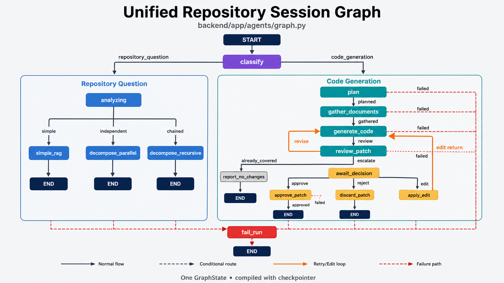

The agents are coordinated by one [LangGraph session graph](backend/app/agents/graph.py), sharing a single `GraphState`. The `classify` node routes each request into one of two branches:

- **Repository questions:** `analyzing` selects `simple_rag` for a focused question, `decompose_parallel` for independent subquestions, or `decompose_recursive` for chained questions. Each strategy retrieves repository context and streams a grounded answer; the session service persists the exchange and citations. Section 7.3 explains how these strategies execute.
- **Test generation:** `plan` defines the retrieval needs, `gather_documents` collects source and existing tests, and `generate_code` proposes test files. The backend validates the files and derives a Git diff before `review_patch` assesses the patch. Review can return it for a bounded revision, report no changes when an empty patch exhausts the attempts, or pause at `await_decision` for the owner.
- **Owner decisions and completion:** approval commits, pushes, and opens a GitHub pull request; rejection discards the patch; an edit adds owner feedback and returns to generation. Orange arrows show revision/edit loops, while red dashed paths lead recorded stage failures to `fail_run`. The `already_covered` route means no changes were produced; it does not establish test coverage through execution.

The graph is compiled with a checkpointer so an owner decision can resume the paused workflow with its existing state. Section 7.5 details the agent tool limits, review gate, and decision behavior.

Each fresh question gets a new checkpoint `thread_id`. Session history supplies up to ten previous messages to the graph input; a human decision resumes the original coding run's thread. History display has its own cursor pagination and does not expand the AI context window.

The actual classifier and question-shape analyzer consume the history-bearing message list. Current retrieval reformulation, planner, and answer helpers use the latest question and their supplied context rather than the entire conversation. Follow-up questions should therefore name the relevant behavior or file explicitly when precision matters.

### 4.6 Operational characteristics

- The API creates one shared Weaviate resource set and one checkpoint connection pool **per process**. A graph is composed per request.
- REST persistence generally uses a request-scoped SQLModel session; repository background processing creates a fresh session.
- Checkouts default to `backend/.tmp/repositories/`, beneath user/host/owner/repository identity. Generated branches use `qa-tests/<random UUID hex>`.
- Generation uses a branch in the repository's shared checkout, not a separate Git worktree per run. There is no implemented per-repository generation lock. Overlapping generation runs, or a new run while another awaits approval, can interfere with checkout state; operate one coding run at a time per repository.
- PostgreSQL and Weaviate have Compose volumes. The supplied backend service does **not** mount a persistent checkout volume. Container replacement can preserve database records while losing the checkout needed for future generation or approval; persistent deployments need durable `REPO_PATH` storage.
- There is no automatic fetch/reindex after upstream changes or after a generated PR is merged. Answers and generation are tied to the indexed snapshot.

## 5. Backend API and services

### 5.1 API conventions and authentication

The default API prefix is `/api/v1`. All paths in the tables below are relative to that prefix. Swagger UI is at `/docs`, ReDoc at `/redoc`, and the schema at `/api/v1/openapi.json`.

Login uses `application/x-www-form-urlencoded` with `username` containing the email address and `password` containing the password. It returns an access token used as `Authorization: Bearer <token>`. Tokens use HS256 and expire after eight days by default. Password reset tokens expire after 48 hours by default. There is no refresh-token endpoint; frontend logout removes the local access token.

Most successful reads return HTTP 200. Explicit creation/deletion status codes are shown below. Validation errors use HTTP 422. Domain errors use JSON `{"detail": "..."}` with their mapped status. Authentication and resource errors can return 400, 401, 403, or 404 depending on the boundary.

### 5.2 Authentication and account endpoints

| Method | Path | Access | Purpose |
|---|---|---|---|
| POST | `/login/access-token` | Public | Exchange email/password form fields for a bearer token. |
| POST | `/login/test-token` | Active user | Return the authenticated user. |
| POST | `/password-recovery/{email}` | Public | Send a reset link for an existing account; use the same normal response for unregistered addresses. Requires working email configuration to send. |
| POST | `/reset-password/` | Public, valid reset token | Accept `token` and `new_password`; replace the password. |
| POST | `/password-recovery-html-content/{email}` | Superuser | Return rendered recovery-email HTML for inspection. |
| POST | `/users/signup` | Public | Register with email, password, and optional full name. |
| GET | `/users/me` | Active user | Read own profile. |
| PATCH | `/users/me` | Active user | Update own name/email. |
| PATCH | `/users/me/password` | Active user | Change password after checking the current password; reject an unchanged password. |
| DELETE | `/users/me` | Non-superuser | Delete own account. |
| GET | `/users/` | Superuser | Paginated user list (`skip=0`, `limit=100`). |
| POST | `/users/` | Superuser | Create a user, optionally sending an account email when email is enabled. |
| GET | `/users/{user_id}` | Same user or superuser | Read a user. |
| PATCH | `/users/{user_id}` | Superuser | Update user details, credentials, or flags. |
| DELETE | `/users/{user_id}` | Superuser | Delete another user; reject administrator self-deletion. |

Signup and normal user-creation/password-update schemas require passwords of 8–128 characters. Email uniqueness is checked in both application behavior and persistence.

Sources: [login routes](backend/app/api/routes/login.py), [user routes](backend/app/api/routes/users.py), [authentication dependencies](backend/app/api/dependencies.py), and [security](backend/app/core/security.py).

### 5.3 Repository endpoints

| Method | Path | Purpose and response |
|---|---|---|
| GET | `/repositories/` | Paginated `{data, count}`. Regular users see their own repositories; superusers may list all. |
| GET | `/repositories/{repository_id}` | Read metadata/status; owner or superuser. |
| POST | `/repositories/` | Register and schedule processing; **202**, `RepositoryPublic`. Body: `repository_url`, `token`, optional positive `token_expiration_days`. |
| PUT | `/repositories/{repository_id}` | Replace token and optional expiry after validating remote access; **204**. Does not change URL or processing status. |
| DELETE | `/repositories/{repository_id}` | Delete checkout, repository vectors, then relational repository state; **204**. Blocked while pending/cloning/indexing. |

Public repository responses exclude the token, encrypted token, and local checkout path. Status is one of `pending`, `cloning`, `indexing`, `ready`, or `failed`. Invalid/unsupported URLs, duplicates, inaccessible repositories, processing conflicts, and cleanup failures have domain error responses.

### 5.4 Session, turn, and run endpoints

Let `{session_id}` denote a repository-session UUID, `{run_id}` a coding-run UUID, and `{message_id}` an assistant history-message UUID.

| Method | Path | Purpose and response |
|---|---|---|
| POST | `/sessions` | Create a session for an owned, ready repository; **201**. Body contains `repository_id`. |
| GET | `/sessions` | List `{data, count}`, optionally filtered by `repository_id`, with `skip` and `limit`. Regular users see their own; superusers can list across users. |
| POST | `/sessions/{session_id}/questions` | Submit either a new `question` or a `decision`; returns `text/event-stream`. |
| GET | `/sessions/{session_id}/history` | Read history with optional `before` position and `limit` (default 50); response `{data, has_more, next_before}`. |
| GET | `/sessions/{session_id}/history/{message_id}/cost` | Sum a question turn's recorded cost and token counts. |
| GET | `/sessions/{session_id}/runs/{run_id}` | Read durable status, failure stage/reason, review findings, diff, PR URL, and static-review disclaimer. |
| GET | `/sessions/{session_id}/runs/{run_id}/patch` | Read canonical diff, complete generated files, and external references. |
| GET | `/sessions/{session_id}/runs/{run_id}/cost` | Sum recorded cost and token counts attributed to a coding run. |

Session creation and individual session operations are owner-only, including for superusers. A superuser's ability to list a resource does not imply permission to use another owner's conversation. Session creation requires `ready`; the history-read API itself does not impose that readiness check.

`RepositorySessionCreate` exposes a `title` field, but the current service creates the placeholder title regardless of that field. On the first message, it derives a title by collapsing whitespace and truncating to 60 characters. Sessions are sorted by most recent activity.

History selects the newest page, then returns that page in chronological order. Pass `next_before` as `before` to fetch older messages. Full display history and the ten-message AI input window are separate mechanisms.

The turn schema requires **exactly one** of:

```json
{"question": "Add pytest tests for the password reset flow."}
```

```json
{
  "decision": {
    "coding_run_id": "<run UUID>",
    "verdict": "edit",
    "feedback": "Add an expired-token case using the existing fixtures."
  }
}
```

Questions must be nonblank and at most 4,000 characters. Decision feedback has the same maximum length; `edit` requires nonblank feedback. A decision requires both a resumable run status (`awaiting_approval` or `changes_requested`) and a checkpoint actually paused at `await_decision`. Stale or repeated decisions are rejected.

Sources: [session routes](backend/app/api/routes/sessions.py), [schemas](backend/app/schemas/session.py), [session service](backend/app/services/session_service.py), and [history store](backend/app/db/persistence/session_store.py).

### 5.5 Cost and utility endpoints

| Method | Path | Access and purpose |
|---|---|---|
| GET | `/costs/session/{session_id}` | Owner-only session total. |
| GET | `/costs/repository/{repository_id}` | Owner-only repository total. |
| GET | `/costs/me` | Current user's total. |
| GET | `/costs/all` | Superuser-only total across all users. |
| GET | `/utils/health-check/` | Public liveness check returning JSON `true`; does not query dependencies on every call. |
| POST | `/utils/test-email/` | Superuser email test using the `email_to` query parameter; **201**. |
| POST | `/private/users/` | Unauthenticated development user creation; mounted only when `ENVIRONMENT=local`. |

### 5.6 Stream protocol

The application uses authenticated **POST-based SSE**, consumed through `fetch` and `ReadableStream` rather than the browser's GET-only `EventSource` interface. Each frame contains one JSON object:

```text
data: {"type":"stage","stage":"retrieving"}

data: {"type":"token","content":"The authentication flow..."}

```

| Event type | Meaning |
|---|---|
| `stage` | Progress: `classifying`, `analyzing`, `planning`, `retrieving`, `decomposing`, `synthesizing`, `researching`, `generating`, `reviewing`, `revising`, or `re_reviewing`. |
| `token` | Fragment of the final repository answer. Intermediate classification, decomposition, and agent reasoning are not exposed as answer tokens. |
| `result` | Persisted repository answer, citations, session ID, and assistant message ID. |
| `run_started` | UUID of the newly persisted coding run. |
| `review_result` | Final escalated patch, acceptance flag, score, threshold, findings, and disclaimer; owner action is required. |
| `run_failure` | Failed coding stage and user-facing reason, with run ID when available. |
| `run_approved` | Published branch, diff, PR URL, explanatory message, and disclaimer. |
| `run_rejected` | Discarded patch's diff, findings, and disclaimer. |
| `run_no_changes` | No-change terminal outcome. |
| `error` | Out-of-band backend frame for an unexpected streaming exception. |

There is no separate `[DONE]` frame. Normal termination follows the workflow outcome and connection closure. `PatchResult` is internal graph state, not a streamed event. After a stream closes, the frontend uses normal GET requests for patch details and costs.

The frontend synthesizes a separate `transport_error` event for failed HTTP responses, parsing problems, and network errors. The current reader does not normalize the backend's `error` frame into `transport_error`, and the UI handlers do not explicitly handle `error`; this is a current error-display gap.

### 5.7 Core services

| Service/component | Responsibility and collaborators |
|---|---|
| `RepositoryService` | Authorization, duplicate detection, encrypted credentials, clone/index state transitions, and cleanup; calls stores, Git commands, and ingestor. |
| `DocumentIngestor` | Loads committed files, stores parents, chunks/embeds content, and manages repository vectors within a user tenant. |
| `DocumentRetriever` | Hybrid candidate retrieval, optional multi-query fusion, Cohere reranking, and PostgreSQL parent hydration. |
| `RepositorySessionService` | Session ownership, history, graph execution/resume, exchange persistence, and fresh-turn usage recording. |
| `RepositorySessionExecution` | Converts persisted history and repository checkout metadata into graph input. |
| `RepositoryDocumentPartitioner` | Executes planner retrieval requests and groups results according to the request's `source` or `test` type; confines candidate path hints to the checkout. |
| `PatchBuilder` / `LocalGitWorkspace` | Validate complete-file proposals, manage the local generation branch, write files, stage changes, derive the diff, and persist the patch. |
| `ReviewPolicy` / review gate | Resolve threshold/retry settings and choose revision, owner escalation, or no-change outcome. |
| `DecisionFinalizer` / `GitPatchPublisher` | Commit/push/open a PR on approval, or restore/discard on rejection; distinguish commit, push, and PR-creation failures. |
| `UsageCapturingCallback` / pricing | Collect model usage and estimate chat cost from the response's actual model ID and a local price table. |
| `CostRollupService` | Apply ownership checks and aggregate recorded cost/token totals. |

Deletion of an account relies on database/ORM cascading. It does not call the repository cleanup service to remove every checkout and vector index. Repository deletion through its dedicated endpoint performs that external cleanup explicitly.

## 6. User interface and user interaction

### 6.1 Screens and navigation

| URL | Screen and interactions |
|---|---|
| `/login` | Email/password form with signup and recovery navigation. |
| `/signup` | Account registration with name, email, password, and confirmation. |
| `/recover-password` | Request a reset email. |
| `/reset-password` | Set a password using the token in the reset-link query string. |
| `/` | Copilot shell, repository/session browser, repository status, chat, and coding-run cards. |
| `/repositories/new` | GitHub URL/token form with optional expiration days. |
| `/settings` | My profile and AI cost summary, password change, and account-deletion controls. |

The authenticated layout contains a collapsible sidebar with the Copilot link, repository/session panel, appearance controls, and user menu. The default theme is dark. Account settings also show the global AI cost total for a superuser.

Repository/session selection is represented in URL search parameters:

```text
/?repository=<repository UUID>&session=<session UUID>
```

The UI still accepts the older `selected` repository parameter used by onboarding. It also stores the last selected repository/session in user-scoped local storage and restores accessible selections on return.

### 6.2 Copilot layout

The following is a schematic of the implemented component arrangement. For captured UI screenshots, follow the illustrated walkthrough in [section 10](#10-usage-examples).

```text
+-----------------------+-----------------------------------------------+
| AI Codebase Copilot    | Selected repository / session                 |
|                       | Session AI cost estimate                      |
| Copilot               +-----------------------------------------------+
| Repositories       +  | Older history / conversation                  |
|   owner/repository    |                                               |
|   status              | User question                                 |
|   repository AI cost  | Assistant answer and source paths             |
|   New session         |                                               |
|   session list        | Or: patch review, findings, diff               |
|                       | Approve / Reject / Edit                       |
|                       | Run details and AI cost estimate              |
| Appearance            +-----------------------------------------------+
| User / settings       | Ask about the selected repository      [Ask]  |
+-----------------------+-----------------------------------------------+
```

An empty account sees **Connect a repository to get started**. A processing or failed repository displays its state, failure reason when present, and **Update token**. A ready repository exposes sessions and the conversation. The composer sends with **Ask** or Enter; Shift+Enter inserts a newline.

Source: [Copilot shell](frontend/src/routes/_layout/index.tsx), [repository panel](frontend/src/components/Sidebar/RepositoryPanel.tsx), and [authenticated layout](frontend/src/routes/_layout.tsx).

### 6.3 Answers and coding-run cards

- Answers render Markdown with GitHub-flavored formatting and a separate list of source paths.
- Stage indicators report retrieval, generation, research, review, and revision progress.
- A live review card shows **Accepted** or **Rejected**, the score and threshold, categorized findings, the diff, and the static-review disclaimer. These labels describe the AI review, not the owner's final decision.
- **Approve** publishes the patch. **Reject** discards it, with optional feedback. **Edit** requires feedback and asks the generator to revise the same run; it is not an inline code editor.
- **View run details** lazily fetches persisted run and patch records and shows status, findings, the diff, proposed file paths, and external reference links. The patch API also returns complete file contents, although the details UI lists their paths rather than displaying each complete file separately.
- Final cards show **Approved and pushed**, **Rejected and discarded**, a stage failure, or **No new tests were generated**.
- AI cost estimates are read separately after completion; labels are hidden when there is no recorded token usage.

[`DiffView`](frontend/src/components/DiffView.tsx) presents the canonical unified diff by file, with additions/deletions and line information. The model does not directly author the displayed diff.

### 6.4 Persistence and UI recovery limits

The frontend keeps active transcript, stage, and error state keyed by session so switching sessions does not redirect an in-flight stream into the wrong conversation. It loads the newest history page and can prepend older pages while preserving scroll position. REST queries use a 30-second stale interval by default and disable automatic window-focus refetching.

Persisted run APIs restore outcomes and patch data, but `CodingRunPublic` does not expose the original numerical review score/threshold. Also, owner-decision buttons currently belong to the live `review_result` card; reloaded run summaries do not recreate those controls. A paused run remains resumable through the API when its checkpoint and checkout are available.

The frontend stores the bearer token in `localStorage`. Generated REST-client 401/403 errors clear it and navigate to login. The custom streaming client reports failed HTTP responses as stream errors instead of using that shared redirect handler.

## 7. GenAI implementation

### 7.1 Intent routing and model roles

The graph first classifies the request as `repository_question` or `code_generation`. The classifier prompt reserves generation for explicit requests to write, add, fix, or improve automated tests. Ambiguous requests default to question answering. A second planner checks test-writing scope on the generation branch.

| Role | Primary configured default | Cross-provider fallback | Output limit |
|---|---|---|---|
| Classifier, question-shape analysis, query reformulation/decomposition, planner, question answering | OpenAI `gpt-4o-mini` (`LLM_MODEL`) | Anthropic `claude-haiku-4-5` (`DEFAULT_LLM_FALLBACK_MODEL`) | 2,000 tokens per call by default. |
| Test generator and reviser | OpenAI `gpt-4o` (`LLM_MODEL_STRONG`) | Anthropic `claude-sonnet-4-6` (`STRONG_LLM_FALLBACK_MODEL`) | 7,000 tokens per call by default. |
| Static reviewer | Anthropic `claude-haiku-4-5` (`LLM_MODEL_STRONGEST`) | OpenAI `gpt-4o-mini` (`REVIEWER_FALLBACK_LLM_MODEL`) | 7,000 tokens per call by default. |

All constructors use `TEMPERATURE=0.0` by default and `LLM_MAX_RETRIES=3` for provider SDK retries. The fallback wrapper distinguishes transient provider failures such as rate limiting, connection/timeouts, and server errors from deterministic failures. Authentication, invalid requests, and unrelated programming errors do not automatically trigger a second provider. Generator/reviewer fallback reruns the agent invocation on the fallback provider.

The labels “strong” and “strongest” are configuration names; the table describes how the actual wiring uses them. Sources: [composition root](backend/app/api/dependencies.py), [model factories](backend/app/integrations/llm.py), and [fallback implementation](backend/app/agents/fallback.py).

### 7.2 Ingestion and parent-document RAG

The ingestion pipeline loads nonempty committed UTF-8 text through `GitLoader`. It excludes dependency lockfiles, paths under `vendor`, `third_party`, or `node_modules`, and files larger than `MAX_INGEST_FILE_BYTES` (1,000,000 bytes by default). Binary/unreadable text is outside the loader's eligible input. At least one loaded `.py` file is required.

The file-type mapping currently recognizes:

| File type | Chunking | Metadata category/language |
|---|---|---|
| `.py` | Python-aware recursive splitting | `code` / `python` |
| `.md` | Markdown-aware recursive splitting | `docs` / `markdown` |
| `.toml` | Generic recursive splitting | `config` / `text` |
| Other eligible text | Generic recursive splitting | `other` / `text` |

All splitters measure size with the `voyageai/voyage-code-3` tokenizer. Defaults are 500-token chunks, 10-token overlap, and `voyage-code-3` embeddings with 1,024 dimensions. The tokenizer may download model files on first use.

Retrieval performs:

1. A Weaviate hybrid search, combining BM25 and embedding similarity with ranked fusion, scoped to user tenant and repository ID.
2. Optional reciprocal-rank fusion across query variants.
3. Cohere reranking against the question.
4. Deduplication by `parent_id`, lookup of complete documents in PostgreSQL, and a repository-ID recheck.
5. Selection of up to `FINAL_PARENT_LIMIT` full documents for each retrieval request.

`TOP_K=10` is the per-search candidate count and the configured reranker's `top_n`; `FINAL_PARENT_LIMIT=5` limits hydrated parents. `HYBRID_SEARCH_ALPHA=0.3` in the settings class weights hybrid search toward keyword matching; 0 means keyword-only and 1 means vector-only. `.env.example` overrides this to 0.7 and selects a different reranker, as detailed in section 8.

Sources: [ingestor](backend/app/rag/ingestor.py), [retriever](backend/app/rag/retriever.py), and [Weaviate resources](backend/app/integrations/weaviate/resources.py).

### 7.3 Three question-answering strategies

| Question shape | Implemented strategy |
|---|---|
| `simple` | Generate up to three alternative queries; deduplicate/cap them, search each, merge chunk rankings using reciprocal-rank fusion (`RRF_K=60`), rerank, hydrate, and stream an answer. An unusable reformulation result falls back to the original question. |
| `independent` | Decompose into at most three independent questions, retrieve each in a loop, answer subquestions with the model's batch interface, and stream a final synthesis. The node name `decompose_parallel` does not mean vector searches run concurrently. |
| `chained` | Decompose into at most three ordered questions, retrieve their contexts, answer sequentially while supplying prior Q&A pairs, and stream a synthesis. Retrieval is performed before these sequential answers; later answers do not dynamically issue new searches. |

The synthesized citation list is deduplicated from retrieved parent source paths. Prompts separately instruct the model to place inline `[Source: <path>]` citations. These are provenance aids, not a programmatic proof that each generated claim is supported.

If retrieval produces no usable documents, the answer helper returns an insufficient-context message without asking the answer model to fill the gap. Only final-answer calls carry the tag that permits token forwarding to the UI; query variants and intermediate answers stay internal.

### 7.4 Prompt engineering and structured outputs

[System prompts](backend/app/agents/prompts/prompts.py) define each role's persona, context, task, constraints, and expected format:

- **Question answerer:** use only retrieved context, cite exact paths, and state missing evidence.
- **Intent classifier:** distinguish asking about tests from asking to produce test code.
- **Planner:** admit automated-test work and emit typed retrieval requests for source and existing tests.
- **Generator:** follow repository imports/framework conventions, cover happy and unhappy paths, prefer readable tests, and return complete files.
- **Reviewer:** assess coverage, readability, grounding, scope, and framework currency, then return a score from 0 to 10 and categorized findings.
- **Reviser:** receive the original task and context plus prior files, canonical diff, and findings. Accumulated owner feedback has priority over reviewer suggestions.

Pydantic schemas constrain classifications, retrieval requests, generated files, and review outputs. The reviewer uses LangChain `ToolStrategy(PatchReview)` to request structured output as a tool result. External references are harvested from actual generator `web_search` tool messages, rather than accepted as invented model-provided URLs.

Retrieved repository content and patch text are explicitly framed as untrusted reference data in the main generation/review/answer prompts. This is a prompt-level control complemented by backend path checks. The ingestor still contains a sanitization TODO; no complete content-sanitization system is implemented.

### 7.5 Bounded agents, review, and human decisions

The generator and reviewer are ReAct-style `create_agent` loops. Their only operational tool is `web_search`, backed by Tavily. Each agent invocation permits at most **three web searches**. Further searches are blocked while allowing structured final output. Search failures become JSON error payloads that the agent can handle.

Neither agent has shell or filesystem tools. Web research is intended for framework syntax and practices; repository documents remain the source for claims about the code under test.

The backend validates all proposed file paths before writing: paths must stay within the checkout, avoid symlink components, end in `.py`, and satisfy the existing-test/new-test-root rules. It then stages files and obtains the canonical diff from Git. Review independently rechecks the file boundary.

The backend gate accepts a nonempty patch when its score meets `REVIEW_PASS_THRESHOLD` (default **7/10**) and the file boundary check passes. A low score or empty proposal triggers revision while `MAX_GENERATION_RETRIES` (default **2**) permits it. Thus a normal fresh task can make an initial proposal plus two revisions.

- A passing nonempty patch pauses for the owner; it is never automatically published.
- A nonempty patch still below threshold after the retry budget also pauses, in `changes_requested`. The owner can still approve, reject, or edit it.
- The implementation retains the latest attempt; it does not select the highest-scoring attempt from a history of candidates.
- An empty patch after all attempts yields `run_no_changes` and status `succeeded`. The message says existing tests cover the request, but no execution or coverage analysis substantiates that statement; the concrete result is that no changes were produced.
- An owner **Edit** keeps the run, branch, retrieved documents, and proposals; appends feedback; resets the automatic retry counter; and revises in place. The owner-requested revision consumes the first retry in that fresh budget.
- **Approve** commits with `Add generated tests`, pushes the branch, and opens a PR titled `Add generated tests` against GitHub's default branch. Its body contains score, threshold, findings, and the execution disclaimer. Successful approval and rejection restore the local checkout to the indexed commit and remove the temporary local branch.
- A PR-creation failure after a successful push is recorded as `github_pull_request`; the pushed branch can already exist remotely even though the run failed.

### 7.6 Cost tracking and observability

With `track_costs=true` (default), each **fresh session turn** attaches a usage callback. It records responding model/provider, originating graph node, input/output/total tokens, and cost derived from the local USD-per-million-token table in [pricing.py](backend/app/services/usage/pricing.py). This is an application estimate, not an invoice or live provider-price lookup. Unknown models retain token counts with a null per-call cost and a warning; totals sum priced calls only.

Usage persistence runs in a `finally` path, including failure/disconnect paths when usage has been captured. Successful question turns anchor to the assistant history message; generation turns anchor to the coding run. Unanchored early failures may still contribute to broader session/repository totals.

Current metering limits:

- Voyage embeddings, Cohere reranking, Tavily searches, hosting, and other non-chat costs are not included.
- The human-decision resume path does not attach/persist the same callback. Model calls made by an owner **Edit** are therefore not captured through the fresh-turn cost mechanism.
- Unknown-model spend is omitted from the numeric total rather than automatically priced.

Optional LangSmith configuration enables traces when tracing and its key are configured. Optional Sentry initialization applies outside `local`. Standard application logs cover lifecycle and integration failures. Enabling external tracing can transmit prompt/context data to that service.

## 8. Installation and configuration

### 8.1 Prerequisites

For the complete local workflow, provide:

- Git and a checkout of this repository.
- Docker with Docker Compose for PostgreSQL and Weaviate, or equivalent reachable services.
- Python **3.13**, matching the backend image, and uv for native backend development. The package declares `>=3.10,<4.0`, but source imports such as `datetime.UTC` require a newer interpreter than 3.10; use the image's version for these instructions.
- Bun 1.x for the frontend workspace. The repository's Playwright CI specifies Bun 1.3.12. Node.js 22.12+ can supply compatible tooling when using Vite outside Bun.
- Valid `OPENAI_API_KEY`, `ANTHROPIC_API_KEY`, `VOYAGE_API_KEY`, `COHERE_API_KEY`, `TAVILY_API_KEY`, and `HF_TOKEN` values for the configured integrations.
- A GitHub repository containing Python and an existing test layout, plus a credential that can read it and, for publication, push a branch and create a pull request.
- Network access to the configured model, embedding, reranking, search, tokenizer-hosting, and GitHub services.

All six integration-key fields are required strings in `Settings`. `.env.example` leaves them empty, and empty values are ignored by the settings loader, so the copied example alone is not sufficient for application startup. The app currently has no supported key-free/offline mode.

### 8.2 Prepare the checkout and dependencies

Run from the repository root. If configuration files already exist, edit them rather than overwriting them.

```bash
cp .env.example .env
uv sync --package app --python 3.13
bun install --frozen-lockfile
```

The root uv workspace contains the `backend` package named `app`; the root Bun workspace contains `frontend`. Commit dependency changes through the normal lockfile workflow. For validation that requires an unchanged lockfile, use `uv sync --locked --package app --python 3.13`; it will report a manifest/lock mismatch instead of resolving it silently.

Create or edit `frontend/.env`:

```dotenv
VITE_API_URL=http://localhost:8000
```

The value is the API **origin**, without `/api/v1`; client paths add the prefix. Restart Vite after changing it. In a built frontend it is a build-time value, so changing runtime Nginx environment variables does not rewrite the bundle.

### 8.3 Configure `.env`

Choose fresh secrets and credentials rather than reusing the example file's values. After installing Python dependencies, these commands generate a signing secret and a Fernet key:

```bash
uv run --package app python -c 'import secrets; print(secrets.token_urlsafe(32))'
uv run --package app python -c 'from cryptography.fernet import Fernet; print(Fernet.generate_key().decode())'
```

Paste the outputs into `SECRET_KEY` and `REPOSITORY_TOKEN_ENCRYPTION_KEY`. Keep the encryption key stable for existing encrypted repository tokens. Outside local development, a valid dedicated Fernet key is mandatory; locally, omitting it derives a key from `SECRET_KEY`.

| Setting | Local value / behavior |
|---|---|
| `PROJECT_NAME` | Set to `QA Test Generator`; controls API title and default email sender name. The example retains the template title. |
| `ENVIRONMENT` | `local`, `staging`, or `production`; use `local` for local development. |
| `SECRET_KEY` | Stable, newly generated JWT signing secret. |
| `REPOSITORY_TOKEN_ENCRYPTION_KEY` | Newly generated Fernet key for stored GitHub tokens. |
| `FIRST_SUPERUSER`, `FIRST_SUPERUSER_PASSWORD` | Initial administrator email and password used by the seed script. |
| `POSTGRES_SERVER`, `POSTGRES_PORT` | `localhost`, `5432` for a native backend. Compose supplies `db` to backend/prestart containers. |
| `POSTGRES_DB`, `POSTGRES_USER`, `POSTGRES_PASSWORD` | Match the database being created by Compose. |
| `FRONTEND_HOST` | `http://localhost:5173`; also used in email links and CORS. |
| `BACKEND_CORS_ORIGINS` | Allowed origins as a comma-separated string or JSON array. The frontend host is additionally included. |
| `OPENAI_API_KEY`, `ANTHROPIC_API_KEY` | Primary/fallback chat clients. |
| `VOYAGE_API_KEY`, `HF_TOKEN` | Embeddings and tokenizer access. |
| `COHERE_API_KEY`, `TAVILY_API_KEY` | Reranking and agent web research. |
| `WEAVIATE_HTTP_HOST`, `WEAVIATE_HTTP_PORT` | Native backend: `localhost`, `8081`; Compose backend: `weaviate`, `8080`. |
| `WEAVIATE_GRPC_HOST`, `WEAVIATE_GRPC_PORT` | Native backend: `localhost`, `50051`; Compose backend uses `weaviate`. Both protocols must be reachable. |
| `WEAVIATE_HTTP_SECURE`, `WEAVIATE_GRPC_SECURE` | `false` for the supplied local service. |
| `WEAVIATE_API_KEY` | Optional when the target Weaviate deployment requires authentication. Local Compose enables anonymous access. |
| `WEAVIATE_COLLECTION` | `Document`. |
| `REPO_PATH` | Defaults to `backend/.tmp/repositories`; use an absolute writable durable path when overriding. |
| `SMTP_HOST`, `SMTP_PORT`, `SMTP_USER`, `SMTP_PASSWORD` | SMTP delivery configuration; see the Mailcatcher example below. |
| `SMTP_TLS`, `SMTP_SSL` | Defaults `true`, `false`; use `false`, `false` for local Mailcatcher. |
| `EMAILS_FROM_EMAIL`, `EMAILS_FROM_NAME` | Sender address and optional sender name. |
| `SENTRY_DSN` | Optional error monitoring outside local. |
| `LANGSMITH_TRACING`, `LANGSMITH_API_KEY` | Optional tracing switch and credentials; default tracing is false. |
| `LANGSMITH_PROJECT`, `LANGSMITH_ENDPOINT` | Default `qa-test-generator` and `https://api.smith.langchain.com`. |
| `DOMAIN`, `STACK_NAME` | Compose/Traefik host and stack naming; local example uses `localhost`. |
| `DOCKER_IMAGE_BACKEND`, `DOCKER_IMAGE_FRONTEND`, `TAG` | Compose image names/tag. Example names are `backend` and `frontend`; tag defaults to `latest`. |

**Configuration precedence matters:** `Settings` reads `../.env` relative to the backend process working directory, and its source order gives that dotenv file priority over process environment variables (after explicit constructor arguments). Run native backend commands from `backend/`. To change a configured value, edit `.env` rather than assuming a shell export will override it. `frontend/.env` is a separate Vite configuration file.

### 8.4 AI and workflow tuning

These are settings-class defaults unless stated otherwise:

| Setting | Default | Effect |
|---|---|---|
| `LLM_MODEL` / `LLM_MAX_TOKENS` | `gpt-4o-mini` / `2000` | Default role model/output cap. |
| `LLM_MODEL_STRONG` / `STRONG_LLM_MAX_TOKENS` | `gpt-4o` / `7000` | Generator model/output cap. |
| `LLM_MODEL_STRONGEST` / `STRONGEST_LLM_MAX_TOKENS` | `claude-haiku-4-5` / `7000` | Reviewer model/output cap. |
| `DEFAULT_LLM_FALLBACK_MODEL` / `DEFAULT_LLM_FALLBACK_MAX_TOKENS` | `claude-haiku-4-5` / `2000` | Default role fallback. |
| `STRONG_LLM_FALLBACK_MODEL` / `STRONG_LLM_FALLBACK_MAX_TOKENS` | `claude-sonnet-4-6` / `7000` | Generator fallback. |
| `REVIEWER_FALLBACK_LLM_MODEL` / `REVIEWER_FALLBACK_LLM_MAX_TOKENS` | `gpt-4o-mini` / `7000` | Reviewer fallback. |
| `TEMPERATURE`, `LLM_MAX_RETRIES` | `0.0`, `3` | Sampling and SDK retry settings. |
| `EMBEDDING_MODEL`, `EMBEDDING_MODEL_TOKENIZER` | `voyage-code-3`, `voyageai/voyage-code-3` | Embedding service and chunk-sizing tokenizer. |
| `EMBEDDING_DIMENSIONS` | `1024` | Allowed: 256, 512, 1024, 2048. Existing vectors must remain compatible with the embedding configuration. |
| `CHUNK_SIZE`, `CHUNK_OVERLAP` | `500`, `10` | Token-sized chunking. |
| `MAX_INGEST_FILE_BYTES` | `1000000` | Per-file ingestion size cap. |
| `TOP_K`, `FINAL_PARENT_LIMIT` | `10`, `5` | Search/rerank candidate count and hydrated-parent limit. |
| `HYBRID_SEARCH_ALPHA` | `0.3` | Vector share of hybrid search. **`.env.example` sets `0.7`.** |
| `COHERE_RERANK_MODEL` | `rerank-v4.0-pro` | **`.env.example` sets `rerank-v4.0-fast`.** |
| `QUERY_VARIANT_COUNT`, `RRF_K` | `3`, `60` | Simple-question query variants and reciprocal-rank fusion constant. |
| `MAX_SUB_QUESTIONS` | `3` | Cap on question decomposition. |
| `SESSION_HISTORY_LIMIT`, `SESSION_HISTORY_PAGE_SIZE` | `10`, `50` | Previous messages assembled for graph input and history display page size. |
| `REVIEW_PASS_THRESHOLD` | `7` | Review score required to pass, 0–10. |
| `MAX_GENERATION_RETRIES` | `2` | Automatic revisions after an initial proposal; zero disables automatic retries. |
| `CHECKPOINTER_POOL_MAX_SIZE` | `10` | Maximum connections per process in the checkpoint pool. |
| `track_costs` | `true` | Attach fresh-turn chat-usage capture. |
| `GITHUB_API_BASE_URL` | `https://api.github.com` | PR API client URL. Overriding it alone does not bypass the repository URL host allowlist. |

`RECURSION_LIMIT=7` exists in settings, but the session service does not currently pass it as LangGraph's `recursion_limit`; changing it alone does not configure the executing graph's recursion budget.

### 8.5 Local email configuration

For native backend development with Compose Mailcatcher:

```dotenv
SMTP_HOST=localhost
SMTP_PORT=1025
SMTP_TLS=false
SMTP_SSL=false
EMAILS_FROM_EMAIL=noreply@example.com
SMTP_USER=
SMTP_PASSWORD=
```

The local Compose backend override sets the SMTP host to `mailcatcher` and port to `1025`. Inspect delivered messages at `http://localhost:1080`. SMTP is needed for password-recovery delivery, not for ordinary login or repository chat.

## 9. Running the application

### 9.1 Native backend/frontend with Docker data services

This layout runs the databases in Docker and provides native frontend/backend reload loops.

From the repository root:

```bash
docker compose up -d db weaviate mailcatcher
```

Initialize the application schema and seed the configured administrator:

```bash
cd backend
uv run bash scripts/prestart.sh
```

The script waits for PostgreSQL, runs `alembic upgrade head`, and executes the initial-data script. Existing administrator data is not a password-reset mechanism; changing `FIRST_SUPERUSER_PASSWORD` after seeding does not itself update an existing account.

Start the API in a terminal, from `backend/`:

```bash
uv run fastapi dev app/main.py
```

Start the frontend in another terminal, from the repository root:

```bash
bun run dev
```

The API startup connects to Weaviate and provisions the PostgreSQL checkpointer. Database, vector-service, or configuration failures can therefore prevent startup even if the first page you intend to use is only login.

### 9.2 Run the application in Docker Compose

After filling in the root `.env`, run from the repository root:

```bash
docker compose up -d --build backend frontend mailcatcher
```

Dependencies start PostgreSQL, Weaviate, and the one-off `prestart` service. The default local override publishes the backend at port 8000 and the Nginx-served frontend at port 5173. Selecting services explicitly avoids starting the Playwright test container during ordinary development.

For Compose Watch during backend development:

```bash
docker compose watch backend
```

The local backend command uses FastAPI reload and the watch configuration synchronizes backend files/rebuilds dependency changes. The frontend Compose service serves a compiled bundle; native `bun run dev` is the frontend hot-reload option.

Optional local tools:

```bash
docker compose up -d adminer proxy
```

| Component | Local address |
|---|---|
| Frontend | `http://localhost:5173` |
| Backend | `http://localhost:8000` |
| Swagger UI | `http://localhost:8000/docs` |
| ReDoc | `http://localhost:8000/redoc` |
| OpenAPI schema | `http://localhost:8000/api/v1/openapi.json` |
| PostgreSQL | `localhost:5432` |
| Weaviate HTTP | `http://localhost:8081` |
| Weaviate gRPC | `localhost:50051` |
| Mailcatcher UI / SMTP | `http://localhost:1080` / `localhost:1025` |
| Adminer, when started | `http://localhost:8080` |
| Local Traefik dashboard, when started | `http://localhost:8090` |

The optional proxy listens on port 80. `DOMAIN=localhost.tiangolo.com` supports the host-based local routing described in the override, such as `api.localhost.tiangolo.com` and `dashboard.localhost.tiangolo.com`.

### 9.3 Verify and stop

```bash
docker compose ps
curl --fail http://localhost:8000/api/v1/utils/health-check/
curl --fail http://localhost:8081/v1/.well-known/ready
```

The first HTTP check returns `true`. Open `/docs` to inspect contracts, then log in through the frontend. Inspect container logs as needed:

```bash
docker compose logs --tail=100 backend prestart weaviate
```

Stop native processes with Ctrl+C. Stop Compose services with:

```bash
docker compose stop
```

To remove containers while preserving named database/vector volumes, use `docker compose down` without `-v`. Removing the backend container also removes its non-mounted checkout files; account for the checkout persistence limitation in section 4.6 before doing this with repositories you intend to retain.

### 9.4 Builds, generated client, and tests

Frontend production build, from `frontend/`:

```bash
bun run build
```

Regenerate the REST client after backend schema changes, from the repository root:

```bash
bash scripts/generate-client.sh
```

This script imports the FastAPI app to export OpenAPI, writes the frontend schema, runs `openapi-ts`, and runs the frontend lint command. It needs valid backend settings; its lint step writes formatting/fixes. The custom SSE reader remains a separately maintained module.

Backend tests, from `backend/`, against a dedicated test database:

```bash
uv run pytest tests/ -q
```

For the repository's coverage workflow:

```bash
uv run bash scripts/tests-start.sh
```

Tests include API, persistence, RAG, agent graph, stream behavior, review/retry, path safety, publishing, and cost coverage. Some fixtures initialize or clean database records; do not point them at a database containing data you need to preserve. The backend CI workflow also checks a 90% coverage threshold.

Playwright tests, from `frontend/`, with a configured running backend and Mailcatcher:

```bash
bunx playwright install chromium
bun run test
```

The Playwright configuration starts/reuses the Vite frontend. Its setup project authenticates before Chromium tests. Suites cover authentication/settings, repository onboarding/status/credentials, and the Copilot workflow; API mocking in browser tests is not evidence of a live model-provider integration test.

### 9.5 Deployment configuration and troubleshooting

[compose.yml](compose.yml) contains production-style Traefik labels and an external `traefik-public` network; [compose.override.yml](compose.override.yml) supplies local ports, development commands, Mailcatcher, and local proxy behavior. Use explicit Compose file selection when deploying so the local override is not accidentally included. [compose.traefik.yml](compose.traefik.yml) contains the separate proxy configuration, and the GitHub workflows contain staging/production deployment automation.

For deployment, set the real frontend/API domains, rebuild the frontend with its public API origin, configure non-local secrets and encryption, supply persistent checkout storage, and plan for the shared-checkout constraint before scaling API workers. The backend image defaults to four FastAPI workers; the local override replaces that command with a reload server. Checkpoint pools are per worker.

| Symptom | Source-grounded explanation / action |
|---|---|
| Settings validation fails immediately | Fill required values, especially the six integration-key fields; run native commands from `backend/`. |
| Shell export does not change behavior | Root dotenv values have precedence; edit the applicable `.env`. |
| API cannot start | Check PostgreSQL plus Weaviate HTTP **and** gRPC connectivity, credentials, and startup logs. |
| Frontend targets the wrong API | Correct `VITE_API_URL` to the API origin; restart Vite or rebuild the frontend image. |
| Repository becomes `failed` | Inspect `failed_reason`; confirm GitHub access, eligible Python files, embedding/reranker configuration, and tokenizer access. |
| Token replacement succeeds but status stays failed | Credential updates do not rerun processing. There is no retry endpoint; re-registration after appropriate cleanup creates a new indexing lifecycle. |
| Proposed path is rejected | Use existing recognized Python test files or add files beneath an existing `test`/`tests` root. |
| Review says “Accepted” but nothing appears on GitHub | The run is still waiting for owner approval. |
| Failure at `git_push` | Verify write permission and remote availability; the app refuses to push the default branch. |
| Failure at `github_pull_request` | The branch may already have been pushed; inspect it on GitHub before attempting recovery. |
| Reload loses review buttons | Durable summaries currently restore data, not the live decision controls; a valid paused run can be resumed with the decision API. |
| Cost is absent or smaller than expected | Check token capture, `track_costs`, unknown model IDs, excluded non-chat services, and the owner-edit metering gap. |

## 10. Usage examples

The UI walkthrough below follows the supplied screenshots of `fastapi-heroes-app`, from account creation to a generated-test pull request. Use your own accessible Python repository with an existing test layout. Answers, patches, review scores, and cost estimates depend on the indexed repository and the particular run. Sections 10.3–10.7 provide API equivalents with placeholder values.

### 10.1 Connect and explore a repository through the UI

#### Step 1 — Sign up or log in

Open the frontend at `http://localhost:5173`. For a new account, choose **Sign up**, enter your name, email, password, and password confirmation, then choose **Sign Up**. Existing users can enter their email and password and choose **Log In**.

| Create an account | Log in to an existing account |
|---|---|
| 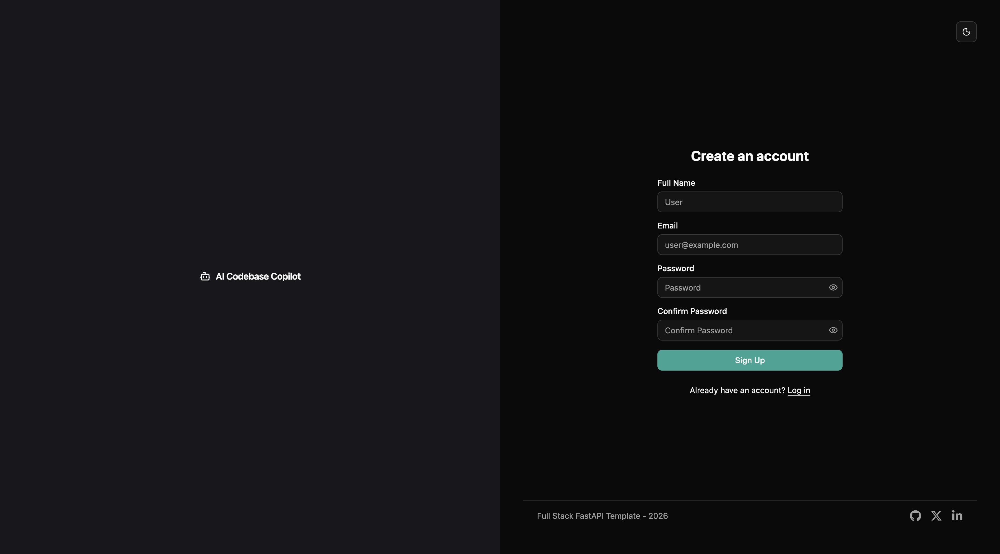 | 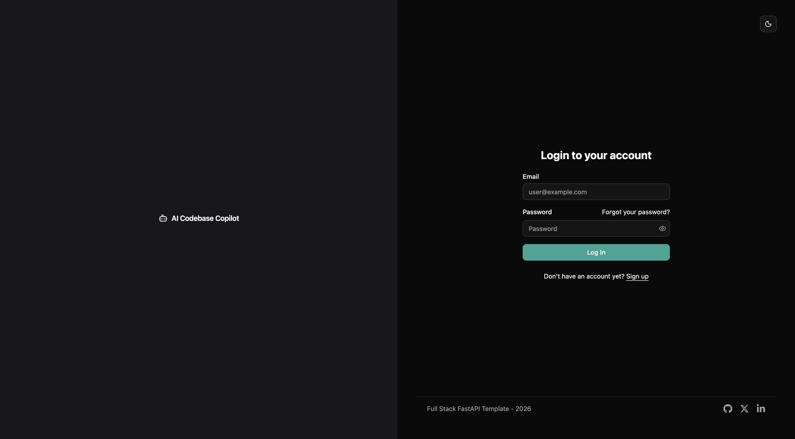 |

#### Step 2 — Connect your GitHub repository

From the empty Copilot screen, choose **Add your code repository**. The **+** beside **Repositories** also opens the registration form.

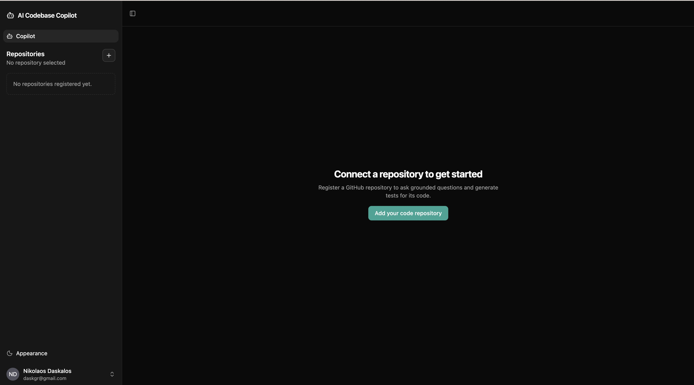

Enter the **GitHub repository URL** and **GitHub token**. A token is required even for a public repository; publishing tests also requires permission to push a branch and create a pull request. **Token expiration in days** is optional metadata and does not renew the token.

| Registration form | Completed example with a masked token |
|---|---|
| 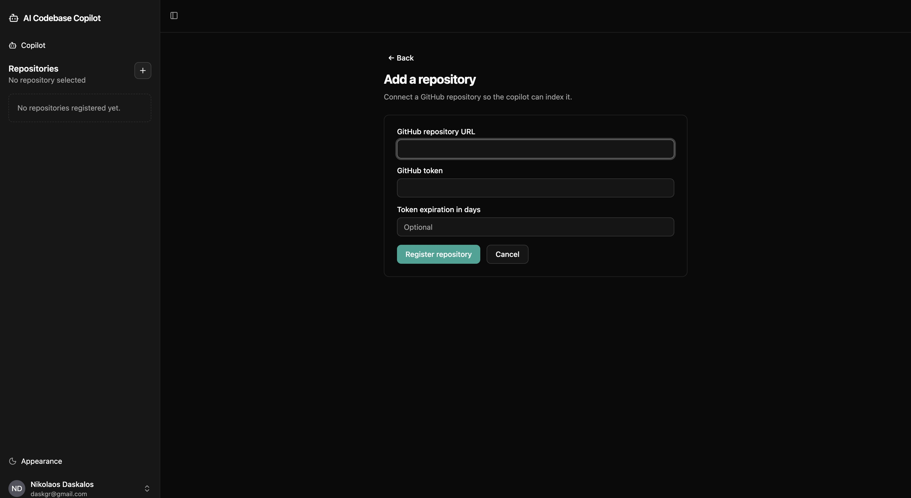 | 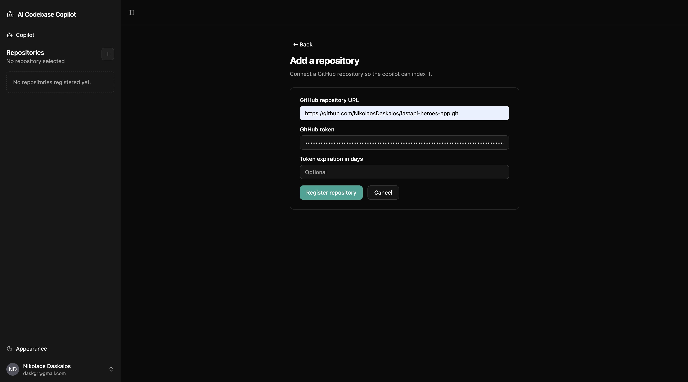 |

Choose **Register repository** to start cloning and indexing.

#### Step 3 — Wait for indexing, then create a session

The repository appears in the sidebar with its processing status. Chat is disabled during indexing. Wait until the badge changes to **ready**; if processing fails, inspect the displayed failure reason.

| Indexing in progress | Ready to start a session |
|---|---|
| 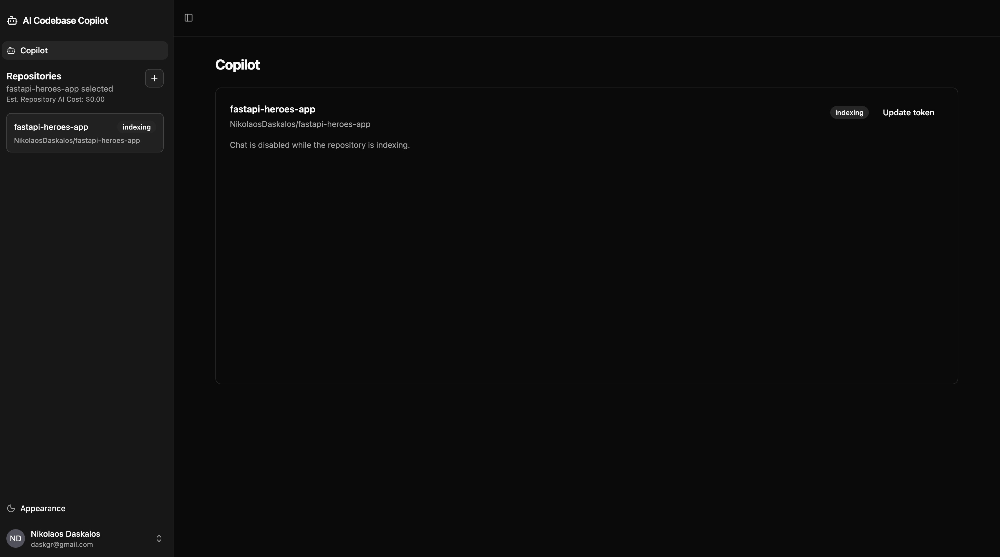 | 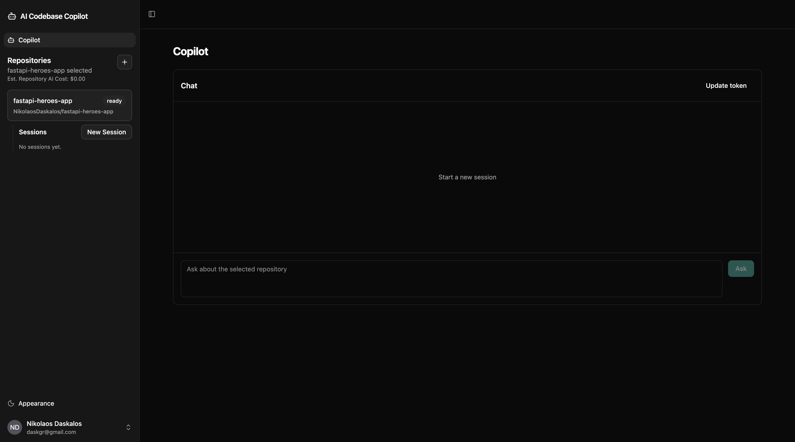 |

Choose **New Session** beneath the selected repository. The new conversation appears in the sidebar, and the chat confirms which repository it is ready to discuss.

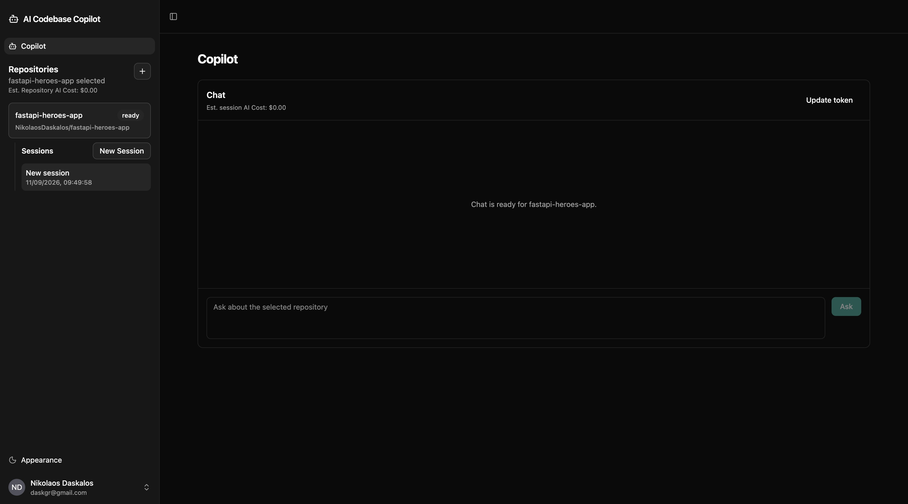

#### Step 4 — Ask a focused repository question

Type a question into **Ask about the selected repository** and choose **Ask** (or press Enter). The captured example asks:

> How auth works in this project?

The response explains the connected repository's authentication flow, names relevant functions and routes, and includes source paths such as `app/routers/auth.py` and `app/dependencies.py`. Read those citations alongside the explanation to identify the code to inspect. The sidebar session title is derived from the first question.

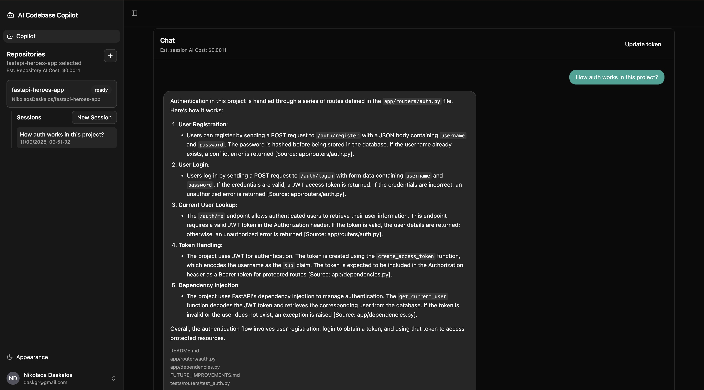

#### Step 5 — Explore several areas or trace a flow

For a broader explanation of the same sample repository, ask:

> How do the heroes, missions, and authentication APIs work?

The captured response organizes the explanation into API areas, with source references for the relevant implementation.

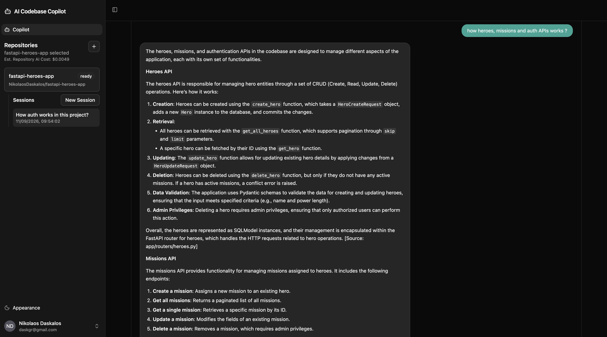

Use self-contained follow-ups that name the behavior you want to explore, for example:

> In the heroes API, how does deleting a hero handle active missions? Name the relevant functions and files.

Other question shapes supported by the router:

| Example | Intended retrieval shape |
|---|---|
| “Where is the database session created?” | Simple focused question with multi-query retrieval. |
| “How do the heroes, missions, and authentication APIs work?” | Independent subquestions. |
| “Trace how a login request reaches password verification and becomes an access token.” | Ordered dependent subquestions. |

Classification is model-driven, so the exact chosen shape is not a fixed phrase-matching rule. Adapt these prompts to the features present in your connected repository.

### 10.2 Generate, revise, and publish tests

#### Step 1 — Request a test change

In a ready repository's session, explicitly ask for tests. The captured example uses:

> Improve heroes API tests

For more control over the proposal, specify the behavior, fixtures, and allowed files, for example:

> Improve the heroes API pytest tests. Cover missing heroes and deletion with active missions, reuse the existing fixtures, and keep all changes under the existing tests directory.

The stream identifies a coding run and reports planning, retrieval, generation, research when used, and review. A low-scoring proposal may produce revision stages before the final review card appears.

#### Step 2 — Read the review findings

The captured run shows **Accepted**, a score of **7/10**, and a threshold of **7**, followed by findings about coverage, readability, conventions, imports, scope, and versioning. **Accepted** means the patch passed the configured static review gate; it still awaits your decision.

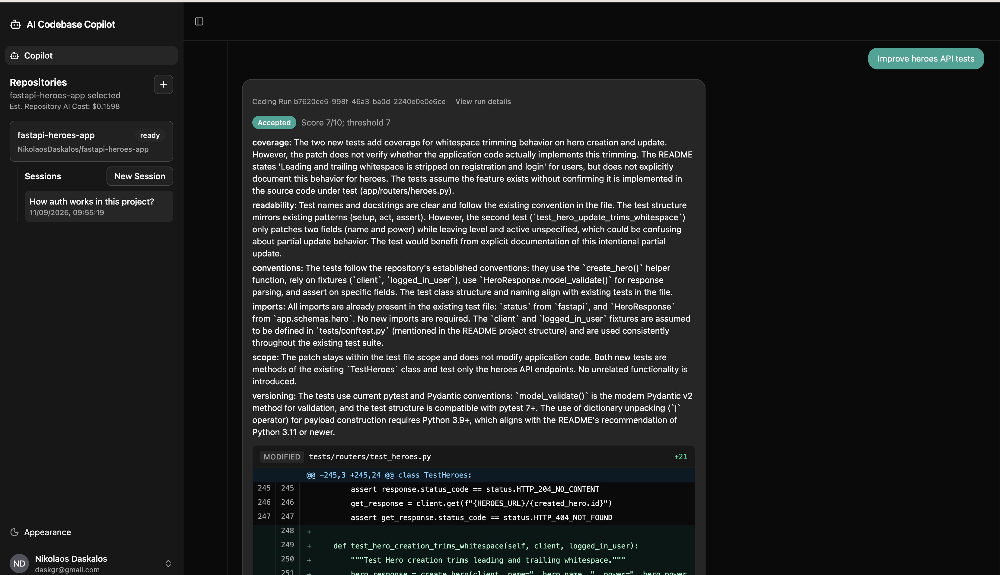

Read the findings even when the score passes. In this example, the reviewer questions whether whitespace trimming is actually implemented for heroes. That is a concrete reason to inspect the source or request a revision before approving.

#### Step 3 — Inspect the diff and choose an action

Scroll down to the file-by-file diff. The captured proposal adds two whitespace-trimming tests to `tests/routers/test_heroes.py`, with **21 added lines**. Check that the assertions match implemented behavior and that the fixtures and imports exist.

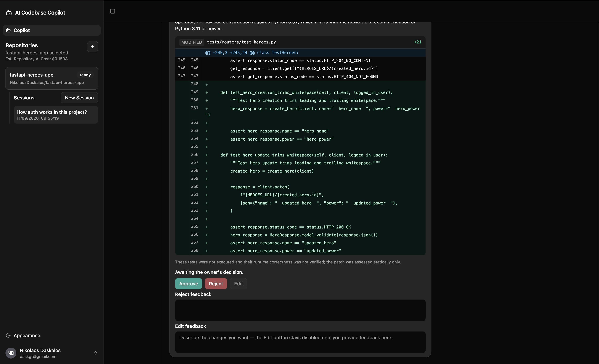

The card states that the tests were not executed and shows **Awaiting the owner's decision**. Choose one action:

| Action | How to use it | Result |
|---|---|---|
| **Edit** | Enter feedback such as “Replace the unverified whitespace-trimming cases with tests for missing heroes and deletion with active missions. Reuse the existing fixtures.” in **Edit feedback**, then click **Edit**. The button is disabled until feedback is provided. | Revises the same run and produces another review for you to inspect. |
| **Reject** | Optionally enter a reason in **Reject feedback**, then click **Reject**. | Discards the local patch and preserves the review record. |
| **Approve** | After inspecting the patch and findings, click **Approve**. | Commits the patch, pushes a separate branch, and opens a GitHub pull request. |

<details>
<summary>View the complete review card in one screenshot</summary>

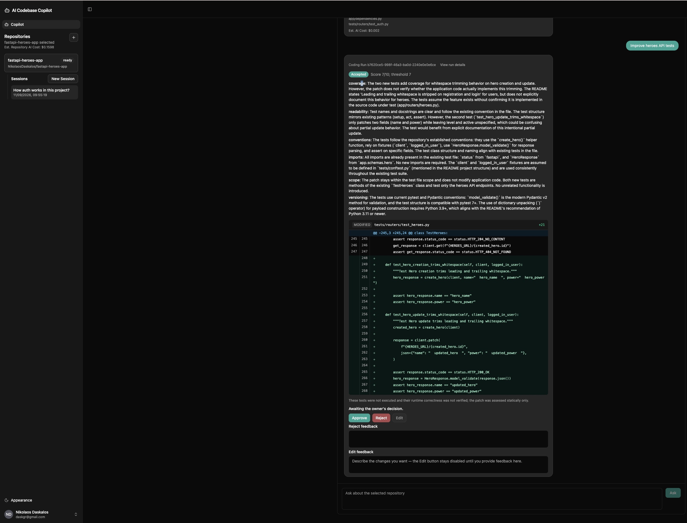

</details>

#### Step 4 — Open the published pull request

After successful approval, the card changes to **Approved and pushed** and displays the generated branch and **View Pull Request** link.

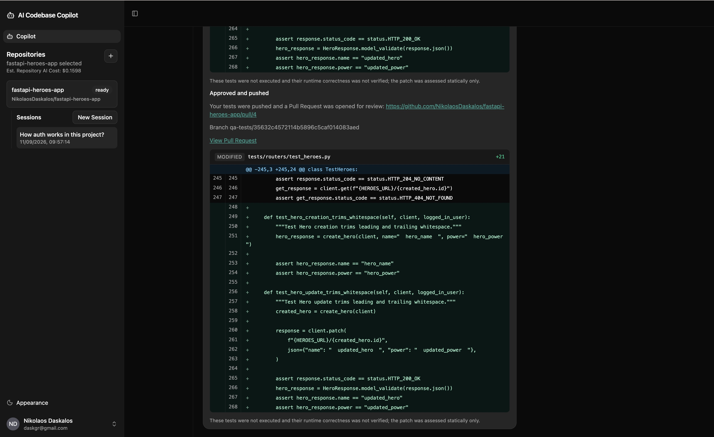

Follow **View Pull Request** to GitHub. The supplied screenshot shows **Add generated tests #4**, an open pull request from a `qa-tests/…` branch into `main`, with one changed file and 21 additions.

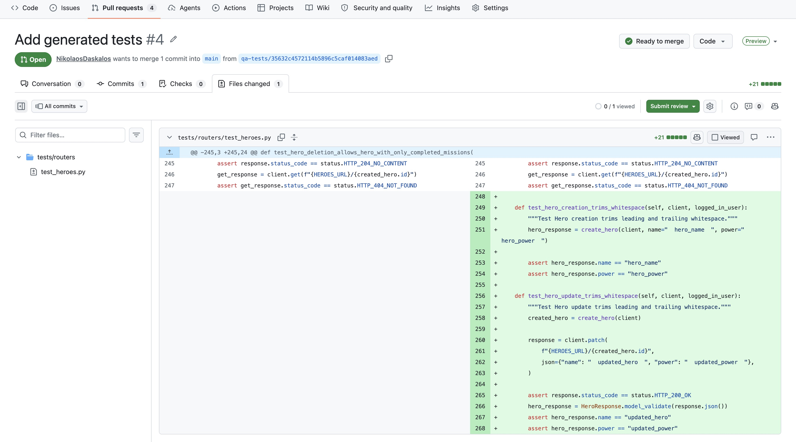

Review **Files changed** and run the connected repository's test/CI workflow before merging on GitHub. The captured PR shows **Checks 0**, so it provides no evidence of passing automated checks. The application does not execute the generated tests or merge the pull request; the AI score is a static assessment.

### 10.3 Authenticate with the API

The following commands are templates to run against your local instance. `jq` is used only to extract response fields; it is not an application runtime dependency. Substitute your own account and repository values. Do not commit access tokens or GitHub credentials into scripts.

```bash
API_URL=http://localhost:8000/api/v1
ACCOUNT_EMAIL=developer@example.com
read -r -s -p 'Account password: ' ACCOUNT_PASSWORD
printf '\n'

ACCESS_TOKEN=$(curl --fail --silent --show-error \
  -X POST "$API_URL/login/access-token" \
  -H 'Content-Type: application/x-www-form-urlencoded' \
  --data-urlencode "username=$ACCOUNT_EMAIL" \
  --data-urlencode "password=$ACCOUNT_PASSWORD" | jq -r '.access_token')

curl --fail --silent --show-error "$API_URL/users/me" \
  -H "Authorization: Bearer $ACCESS_TOKEN"
```

These shell examples use Bash syntax. A new account can first be created through `/signup` in the UI or `POST /users/signup` with JSON `email`, `password`, and optional `full_name`.

### 10.4 Register a repository and open a session

```bash
REPOSITORY_URL=https://github.com/your-org/your-python-project
read -r -s -p 'GitHub token: ' GITHUB_TOKEN
printf '\n'

REPOSITORY_ID=$(jq -n \
  --arg url "$REPOSITORY_URL" \
  --arg token "$GITHUB_TOKEN" \
  '{repository_url: $url, token: $token, token_expiration_days: 30}' |
  curl --fail --silent --show-error -X POST "$API_URL/repositories/" \
    -H "Authorization: Bearer $ACCESS_TOKEN" \
    -H 'Content-Type: application/json' --data-binary @- | jq -r '.id')

curl --fail --silent --show-error "$API_URL/repositories/$REPOSITORY_ID" \
  -H "Authorization: Bearer $ACCESS_TOKEN" | jq '{status, failed_reason}'
```

Repeat the GET until status is `ready`, or inspect the failure reason if it becomes `failed`. Only after it is ready:

```bash
SESSION_ID=$(jq -n --arg id "$REPOSITORY_ID" '{repository_id: $id}' |
  curl --fail --silent --show-error -X POST "$API_URL/sessions" \
    -H "Authorization: Bearer $ACCESS_TOKEN" \
    -H 'Content-Type: application/json' --data-binary @- | jq -r '.id')
```

### 10.5 Stream a question or generation request

```bash
curl --fail --no-buffer -X POST "$API_URL/sessions/$SESSION_ID/questions" \
  -H "Authorization: Bearer $ACCESS_TOKEN" \
  -H 'Content-Type: application/json' \
  -d '{"question":"How is authentication implemented? Cite the source files."}'
```

To request tests, submit another turn to the same endpoint:

```bash
curl --fail --no-buffer -X POST "$API_URL/sessions/$SESSION_ID/questions" \
  -H "Authorization: Bearer $ACCESS_TOKEN" \
  -H 'Content-Type: application/json' \
  -d '{"question":"Add pytest tests for password reset using the existing test fixtures."}'
```

Copy `coding_run_id` from `run_started` or `review_result`. A review event means the patch has reached the owner-decision stage; intermediate proposals are not separately published to the UI.

### 10.6 Inspect a patch and send an owner decision

```bash
RUN_ID=replace-with-coding-run-uuid

curl --fail --silent --show-error \
  "$API_URL/sessions/$SESSION_ID/runs/$RUN_ID/patch" \
  -H "Authorization: Bearer $ACCESS_TOKEN" | jq .

jq -n --arg run "$RUN_ID" \
  '{decision: {coding_run_id: $run, verdict: "edit", feedback: "Add an inactive-user case using existing fixtures."}}' |
  curl --fail --no-buffer -X POST "$API_URL/sessions/$SESSION_ID/questions" \
    -H "Authorization: Bearer $ACCESS_TOKEN" \
    -H 'Content-Type: application/json' --data-binary @-
```

After inspecting the resulting review, send one of the following bodies through the same endpoint. Replace the placeholder with the actual run UUID:

```json
{"decision":{"coding_run_id":"<run UUID>","verdict":"approve"}}
```

```json
{"decision":{"coding_run_id":"<run UUID>","verdict":"reject","feedback":"This duplicates an existing test."}}
```

**Approval performs real GitHub writes:** it commits and pushes a branch and opens a pull request. Rejection discards the generated checkout changes. Both require the authenticated owner and a currently paused run.

### 10.7 Read history, outcomes, and cost estimates

```bash
curl --fail --silent --show-error \
  "$API_URL/sessions/$SESSION_ID/history?limit=50" \
  -H "Authorization: Bearer $ACCESS_TOKEN" | jq .

curl --fail --silent --show-error \
  "$API_URL/sessions/$SESSION_ID/runs/$RUN_ID" \
  -H "Authorization: Bearer $ACCESS_TOKEN" | jq .

curl --fail --silent --show-error \
  "$API_URL/sessions/$SESSION_ID/runs/$RUN_ID/cost" \
  -H "Authorization: Bearer $ACCESS_TOKEN" | jq .

curl --fail --silent --show-error "$API_URL/costs/session/$SESSION_ID" \
  -H "Authorization: Bearer $ACCESS_TOKEN" | jq .
```

For older messages, pass the returned `next_before` position as `?before=<position>&limit=50`. For a completed question's cost, use its `assistant_message_id` in `/sessions/{session_id}/history/{message_id}/cost`. These reads use persisted records and do not invoke a model again.

## 11. Further improvements

The following improvements are planned for the service:

- **Support more programming languages:** Extend repository analysis and test generation beyond Python to languages such as JavaScript, TypeScript, Java, and Go, using each language's testing frameworks and project conventions.
- **Incremental repository synchronization:** Let owners refresh indexed Python files from the latest default branch, updating added, modified, deleted, and renamed files without rebuilding unchanged evidence.
- **Upstream-change detection:** Periodically check whether the remote repository has changed and show a synchronization hint, leaving the owner in control of when to refresh.
- **Shared checkout protection:** Allow only one operation to modify a repository's checkout at a time, including while a generated patch awaits approval. Questions and work on other repositories remain available.
- **Run cancellation and recovery:** Clean up failed or disconnected generation runs by discarding unapproved changes, restoring the indexed commit, and removing temporary local branches so subsequent operations can start safely.
- **Test execution and automatic repair:** Execute generated tests before AI review and use failure output to guide a bounded number of corrections. Report unresolved failures or unavailable execution to the owner.
- **Isolated Docker execution:** Prepare dependencies in a disposable workspace and run generated tests with networking disabled, resource limits, and timeouts, without exposing backend credentials or modifying the original checkout.
- **Execution availability monitoring:** Enable the Docker runner in the service and check its availability at startup and before execution. Keep the service usable when Docker is unavailable and clearly mark tests as not executed.
- **Visible execution results:** Show whether tests passed, failed, or were not executed, together with test counts and a log excerpt, on the review card before the owner approves or rejects the patch.
